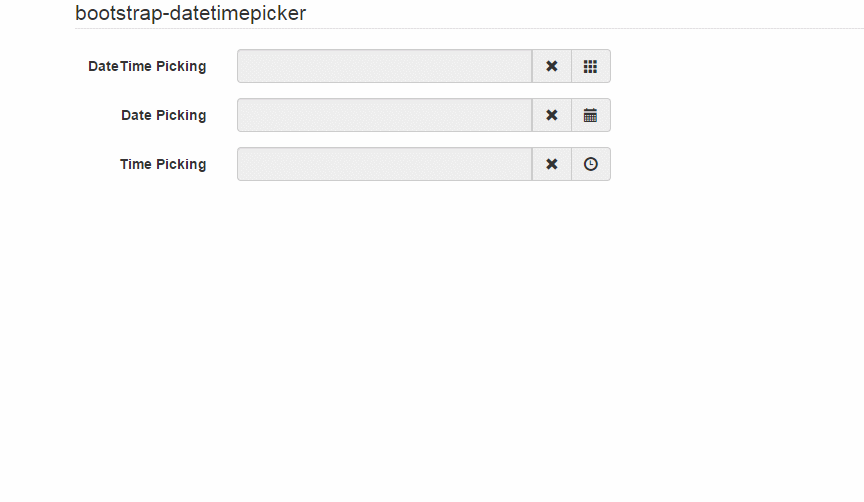
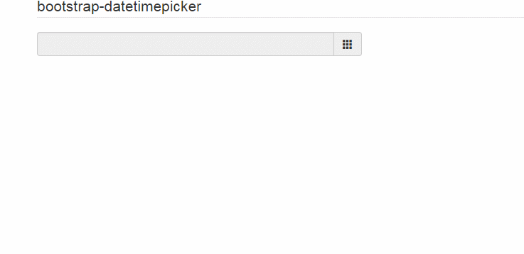
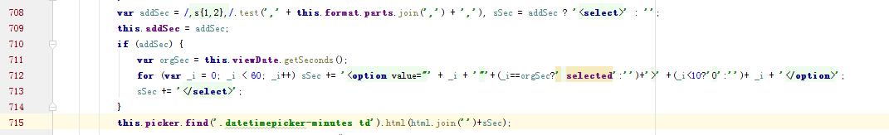
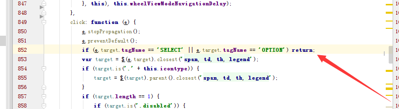
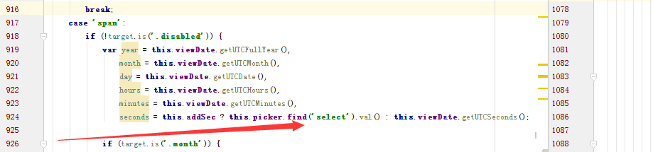

## bootstrap日期插件

效果图


* 引入CSS文件
```
  <link rel="stylesheet" href="css/bootstrap.css">
  <link rel="stylesheet" href="css/bootstrap-datetimepicker.css">
```
* 引入JS文件
```
<script src="js/jquery-3.2.1.js"></script>
<script src="js/bootstrap.js"></script>
<script src="js/bootstrap-datetimepicker.js"></script>
```
* 引入语言版本
```
<script src="js/locales/bootstrap-datetimepicker.zh-CN.js"></script>
<script src="js/locales/bootstrap-datetimepicker.bn.js"></script>
```

#### HTML代码
```
<div class="container">
    <form action="" class="form-horizontal"  role="form">
        <fieldset>
            <legend>bootstrap-datetimepicker</legend>
            <div class="form-group">
                <label for="dtp_input1" class="col-md-2 control-label">DateTime Picking</label>
                <div class="input-group date form_datetime col-md-5" data-date="1979-09-16T05:25:07Z" data-date-format="dd MM yyyy - HH:ii p" data-link-field="dtp_input1">
                    <input class="form-control" size="16" type="text" value="" readonly>
                    <span class="input-group-addon"><span class="glyphicon glyphicon-remove"></span></span>
                    <span class="input-group-addon"><span class="glyphicon glyphicon-th"></span></span>
                </div>
                <input type="hidden" id="dtp_input1" value="" /><br/>
            </div>
            <div class="form-group">
                <label for="dtp_input2" class="col-md-2 control-label">Date Picking</label>
                <div class="input-group date form_date col-md-5" data-date="" data-date-format="dd MM yyyy" data-link-field="dtp_input2" data-link-format="yyyy-mm-dd">
                    <input class="form-control" size="16" type="text" value="" readonly>
                    <span class="input-group-addon"><span class="glyphicon glyphicon-remove"></span></span>
                    <span class="input-group-addon"><span class="glyphicon glyphicon-calendar"></span></span>
                </div>
                <input type="hidden" id="dtp_input2" value="" /><br/>
            </div>
            <div class="form-group">
                <label for="dtp_input3" class="col-md-2 control-label">Time Picking</label>
                <div class="input-group date form_time col-md-5" data-date="" data-date-format="hh:ii" data-link-field="dtp_input3" data-link-format="hh:ii">
                    <input class="form-control" size="16" type="text" value="" readonly>
                    <span class="input-group-addon"><span class="glyphicon glyphicon-remove"></span></span>
                    <span class="input-group-addon"><span class="glyphicon glyphicon-time"></span></span>
                </div>
                <input type="hidden" id="dtp_input3" value="" /><br/>
            </div>
        </fieldset>
    </form>
</div>
```
#### JS代码
```
    $('.form_datetime').datetimepicker({
        language:  'zh-CN',
        weekStart: 1,
        todayBtn:  1,
        autoclose: 1,
        todayHighlight: 1,
        startView: 2,
        forceParse: 0,
        showMeridian: 1
    });
    $('.form_date').datetimepicker({
        language:  'bn',
        weekStart: 1,
        todayBtn:  1,
        autoclose: 1,
        todayHighlight: 1,
        startView: 2,
        minView: 2,
        forceParse: 0
    });
    $('.form_time').datetimepicker({
        language:  'en',
        weekStart: 1,
        todayBtn:  1,
        autoclose: 1,
        todayHighlight: 1,
        startView: 1,
        minView: 0,
        maxView: 1,
        forceParse: 0
    });
```
### bootstrap-datatimepicker 精确到秒

* 效果图



修改源码







HTML CSS JS代码如下
```
<!DOCTYPE html>
<html lang="en">
<head>
    <meta charset="UTF-8">
    <meta name="viewport" content="width=device-width,initial-scale=1"/>
    <meta http-equiv="X-UA-Compitable" content="IE=edge">
    <title>bootstrap日期插件</title>
    <!--[if lt IE 9]>
    <script src="js/html5shiv.min.js"></script>
    <script src="js/respond.min.js"></script>
    <![endif]-->
    <link rel="stylesheet" href="css/bootstrap.css">
    <link rel="stylesheet" href="css/bootstrap-datetimepicker.css">
</head>
<body>
<div class="container">
    <form action="" class="form-horizontal"  role="form">
        <fieldset>
            <legend>bootstrap-datetimepicker</legend>
            <div class="form-group">
                <div class="input-group date form_datetime col-md-5">
                    <input class="form-control" size="16" type="text" value="" readonly >
                    <span class="input-group-addon"><span class="glyphicon glyphicon-th"></span></span>
                </div>
            </div>
        </fieldset>
    </form>
</div>
</body>
</html>
<script src="js/jquery-3.2.1.js"></script>
<script src="js/bootstrap.js"></script>
<script src="js/change/bootstrap-datetimepicker.js"></script>
<script src="js/locales/bootstrap-datetimepicker.zh-CN.js"></script>
<script src="js/locales/bootstrap-datetimepicker.bn.js"></script>
<script>
    $('.form_datetime').datetimepicker({
        language:  'zh-CN',
        format: 'yyyy-mm-dd hh:ii:ss',
        weekStart: 1,
        todayBtn:  true,
        autoclose: 1,
        todayHighlight: 1,
        startView: 2,
        forceParse: 0,
        showMeridian: 1,
        pickerPosition:"bottom-left"
    });
</script>
```
